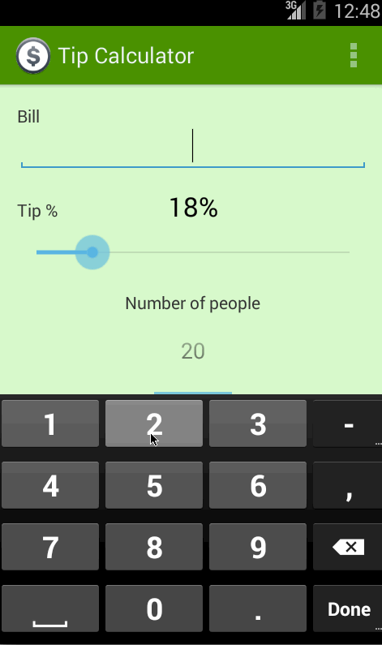

#Tip Calculator Android sample

This is an Android demo application which allows a user to calculate the appropriate tip based on the total amount entered.

Time spent: 8 hours spent in total

Completed user stories:

  * [x] Required: User is displayed the tip of specified percentage for specified entered amount
  * [x] Required: User enters the total amount of the transaction.
  * [x] Required: User can select between tip amounts (i.e 10%, 15%, 20%).
  * [x] Required: Upon selecting tip amount, formatted tip value is displayed.
  * [x] Optional: User changes the total amount and updated tip is reflected automatically.
  * [x] Optional: User can select custom tip percentage if desired.
  * [x] Optional: Experiment with trying input widgets to replace the buttons and/or textviews.

##Notes:

##Walkthrough of all user stories:

  

GIF created with [LiceCap](http://www.cockos.com/licecap/).
